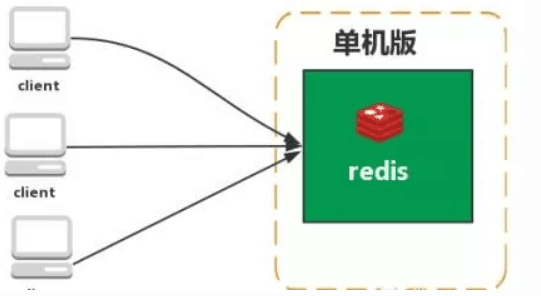
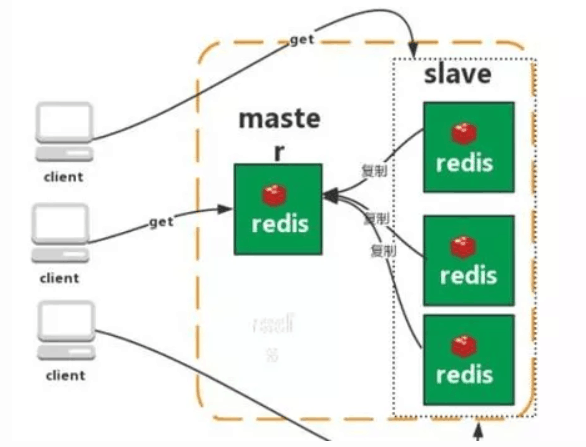
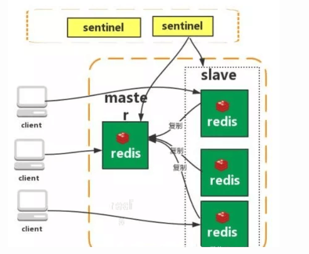
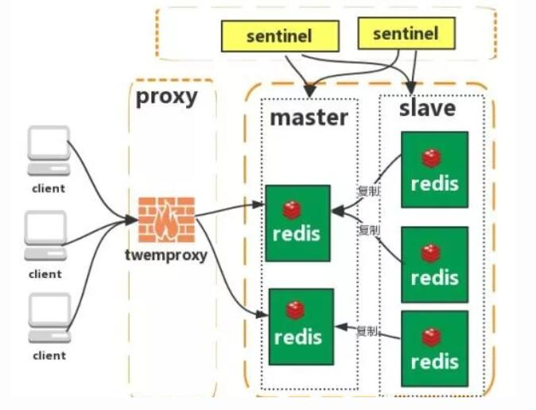
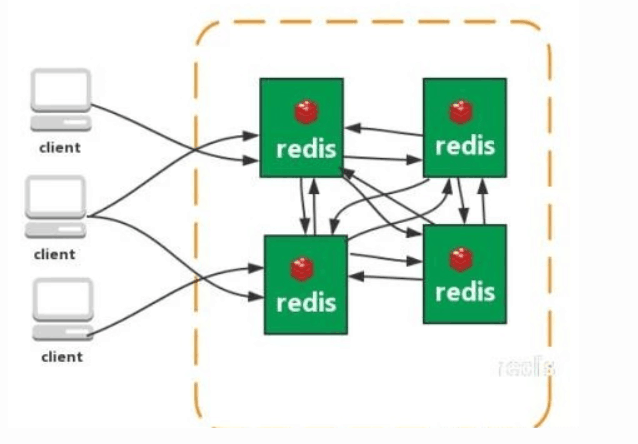

介绍：Redis是一个开源的使用ANSI C语言编写、遵守BSD协议、支持网络、可基于内存亦可持久化的日志型、key-value数据库，并提供多种语言的API 的非关系型数据库。

**Redis支持的数据类型**

string字符串：

hash（哈希）

list（列表）

set（集合）

zset（有序集合）

**什么是Redis持久化？Redis有哪几种持久化方式？优缺点是什么？**

持久化就是把内存的数据写到磁盘中去，防止服务宕机了内存数据丢失。

Redis提供了两种持久化方式RDB(默认）和AOF

**RDB:**

rdb就是Redis DataBase缩写

功能核心函数rdbSave（生成RDB文件）和rdbLoad（从文件加载内存）两个函数

**AOF**

**存储结构**

内容是Redis通讯协议（PESP)格式的命令文本存储。

**什么是RESP?有什么特点？**

RESP是Redis客户端和服务端之前使用的一种通讯协议；

RESP的特点：实现简单、快速解析、可读性好。

**Redis有哪些架构模式？**

**单机版**

特点：简单

问题：

1、内存容量有限 2、处理能力有限 3、无法高可用。

**主从复制**

特点：

1、master/slave角色

2、master/slave数据相同

3、降低master读压力在转交从库

问题：

无法保证高可用

没有解决master写的压力

**哨兵**

Redis sentinel 是一个分布式系统中监控Redis主从服务器，并在主服务器下线是自动进行故障转移。

监控（Monitoring）：Sentinel会不断的检查你的主服务器和从服务器是否运作正常。

提醒（Notification）：当被监控的某个Redis服务器出现问题时，sentinel可以通过API向管理员或者其他应用程序发送通知。

自动故障迁移（Automatic failover）：当一个主服务器不能正常工作时，Sentinel会开始一次自动故障迁移操作。

特点：

1、保证高可用

2、监控各个节点

3、自动故障迁移

缺点：

主从模式，切换需要时间丢数据没有解决master写的压力

**集群（proxy型）：**

Twemproxy 是一个 Twitter 开源的一个 redis 和 memcache 快速/轻量级代理服务器； Twemproxy 是一个快速的单线程代理程序，支持 Memcached ASCII 协议和 redis 协议

特点：1、多种 hash 算法：MD5、CRC16、CRC32、CRC32a、hsieh、murmur、Jenkins 

2、支持失败节点自动删除

3、后端 Sharding 分片逻辑对业务透明，业务方的读写方式和操作单个 Redis 一致

缺点：增加了新的 proxy，需要维护其高可用。

failover 逻辑需要自己实现，其本身不能支持故障的自动转移可扩展性差，进行扩缩容都需要手动干预

**集群（直连型）**

从redis 3.0之后版本支持redis-cluster集群，Redis-Cluster采用无中心结构，每个节点保存数据和整个集群状态,每个节点都和其他所有节点连接。

特点：

1、无中心架构（不存在哪个节点影响性能瓶颈），少了 proxy 层。

2、数据按照 slot 存储分布在多个节点，节点间数据共享，可动态调整数据分布。

3、可扩展性，可线性扩展到 1000 个节点，节点可动态添加或删除。

4、高可用性，部分节点不可用时，集群仍可用。通过增加 Slave 做备份数据副本

5、实现故障自动 failover，节点之间通过 gossip 协议交换状态信息，用投票机制完成 Slave到 Master 的角色提升。

缺点：

1、资源隔离性较差，容易出现相互影响的情况。

2、数据通过异步复制,不保证数据的强一致性

**什么是一致性哈希算法？什么是哈希槽？**

这两个问题篇幅过长 网上找了两个解锁的不错的文章

https://www.cnblogs.com/lpfuture/p/5796398.html

https://blog.csdn.net/z15732621582/article/details/79121213

 

 

**Redis常用命令？**

Keys pattern

*表示区配所有

以bit开头的

查看Exists  key是否存在

Set

设置 key 对应的值为 string 类型的 value。

setnx

设置 key 对应的值为 string 类型的 value。如果 key 已经存在，返回 0，nx 是 not exist 的意思。

删除某个key

第一次返回1 删除了 第二次返回0

Expire 设置过期时间（单位秒）

TTL查看剩下多少时间

返回负数则key失效，key不存在了

Setex

设置 key 对应的值为 string 类型的 value，并指定此键值对应的有效期。

Mset

一次设置多个 key 的值，成功返回 ok 表示所有的值都设置了，失败返回 0 表示没有任何值被设置。

Getset

设置 key 的值，并返回 key 的旧值。

Mget

一次获取多个 key 的值，如果对应 key 不存在，则对应返回 nil。

Incr

对 key 的值做加加操作,并返回新的值。注意 incr 一个不是 int 的 value 会返回错误，incr 一个不存在的 key，则设置 key 为 1

incrby

同 incr 类似，加指定值 ，key 不存在时候会设置 key，并认为原来的 value 是 0

Decr

对 key 的值做的是减减操作，decr 一个不存在 key，则设置 key 为-1

Decrby

同 decr，减指定值。

Append

给指定 key 的字符串值追加 value,返回新字符串值的长度。

Strlen

取指定 key 的 value 值的长度。

persist xxx(取消过期时间)

选择数据库（0-15库）

Select 0 //选择数据库

move age 1//把age 移动到1库

Randomkey随机返回一个key

Rename重命名

Type 返回数据类型

08

**使用过Redis分布式锁么，它是怎么实现的？**

 

先拿setnx来争抢锁，抢到之后，再用expire给锁加一个过期时间防止锁忘记了释放。

如果在setnx之后执行expire之前进程意外crash或者要重启维护了，那会怎么样？

set指令有非常复杂的参数，这个应该是可以同时把setnx和expire合成一条指令来用的！

09

**使用过Redis做异步队列么，你是怎么用的？有什么缺点？**

一般使用list结构作为队列，rpush生产消息，lpop消费消息。当lpop没有消息的时候，要适当sleep一会再重试。

缺点：

在消费者下线的情况下，生产的消息会丢失，得使用专业的消息队列如rabbitmq等。

能不能生产一次消费多次呢？

使用pub/sub主题订阅者模式，可以实现1:N的消息队列。

10

**什么是缓存穿透？如何避免？什么是缓存雪崩？何如避免？**

缓存穿透

一般的缓存系统，都是按照key去缓存查询，如果不存在对应的value，就应该去后端系统查找（比如DB）。一些恶意的请求会故意查询不存在的key,请求量很大，就会对后端系统造成很大的压力。这就叫做缓存穿透。

如何避免？

1：对查询结果为空的情况也进行缓存，缓存时间设置短一点，或者该key对应的数据insert了之后清理缓存。

2：对一定不存在的key进行过滤。可以把所有的可能存在的key放到一个大的Bitmap中，查询时通过该bitmap过滤。

缓存雪崩

当缓存服务器重启或者大量缓存集中在某一个时间段失效，这样在失效的时候，会给后端系统带来很大压力。导致系统崩溃。

如何避免？

1：在缓存失效后，通过加锁或者队列来控制读数据库写缓存的线程数量。比如对某个key只允许一个线程查询数据和写缓存，其他线程等待。

2：做二级缓存，A1为原始缓存，A2为拷贝缓存，A1失效时，可以访问A2，A1缓存失效时间设置为短期，A2设置为长期

3：不同的key，设置不同的过期时间，让缓存失效的时间点尽量均匀

